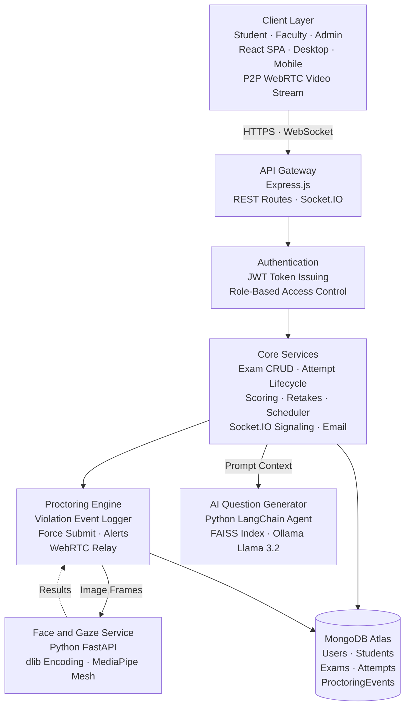

# ProcteredMERN Project Report

Date: April 16, 2026

## 1. Project Summary

ProcteredMERN is a full-stack online examination and proctoring platform built with:
- MERN stack (MongoDB, Express, React, Node.js)
- A Python FastAPI microservice for face and gaze analysis
- Socket.IO + WebRTC for live faculty monitoring
- AI-assisted question generation through an Ollama/LangChain pipeline

The system supports role-based workflows for:
- Admin
- Faculty
- Student

It includes exam authoring, assignment-based delivery, timed attempts, anti-cheat event logging, live invigilation, retake controls, bulk student roster upload, contact/email functionality, blockchain-based submission integrity verification, per-attempt integrity scoring, Markdown/LaTeX question rendering, question paper PDF generation, detailed marksheet exports, and global faculty violation alert notifications.

## 2. High-Level Architecture

**Figure 1.** System architecture of ProcteredMERN. **(1) Client Layer** — React SPAs for student, faculty, and admin with P2P WebRTC streaming. **(2) API Gateway** — Express.js handling REST and Socket.IO. **(3) Authentication** — JWT with role-based access. **(4) Core Services** — exam/attempt lifecycle, scoring, signaling, scheduling. **(5) Proctoring Engine** — violation logging, force submit, WebRTC relay. **(6) Python Services** — FastAPI face/gaze (dlib, MediaPipe) and RAG-based AI question generator (LangChain, FAISS, Ollama). **(7) Data Layer** — MongoDB Atlas.

### Frontend (React + Vite)
- Role-based routes and guarded pages with dynamic environment configuration.
- Pages for admin/faculty/student workflows.
- Exam runner with layered proctoring controls, upcoming exam countdowns, autosave, and enhanced mobile device support.
- Faculty live view with real-time WebRTC student streams, violation alerts, and remote intervention capabilities (e.g., Force Submit).

### Backend (Express + MongoDB)
- JWT authentication and role authorization.
- REST APIs for auth, admin, exams, attempts, proctoring, AI, and contact.
- Socket.IO signaling to handle live proctoring feeds and remote interventions.
- Scheduler for semester/year promotion cycles.

### Python Microservice (FastAPI)
- Face registration and face verification endpoints.
- Proctoring classification (no face / wrong face / multiple faces).
- Gaze tracking session endpoints (frame, summary, end, active).

### AI Service
- Node orchestrator executes Python AI agent.
- AI agent uses local Ollama models (e.g. Llama 3.2) + FAISS textbook retrieval for RAG-based context parsing.
- Generates structured questions from context-limited source material without hallucinating missing data.

## 3. Implemented Features (By User Role)

## 3.1 Admin Features

1. Faculty account management
- Create faculty users with name/email/password
- List all faculty users

2. User and roster directory management
- Separate directory views:
  - Accounts (User documents)
  - Students (roster directory)
  - Faculty
- Filter by role, search, college, department, section, year, semester
- Edit account fields (name, email, roll no, college, department, section, year, semester where applicable)
- Reset account password (to roll number when available)

3. Bulk student upload
- Upload CSV/XLS/XLSX files
- Header normalization and row validation
- Creates Student roster records
- Tracks created/skipped/errors per upload
- Downloadable student upload template provided in frontend public assets

## 3.2 Faculty Features

1. Exam management
- Create exam
- Edit exam
- Delete exam
- List own exams

2. Advanced exam editor
- Question types:
  - Single choice
  - Multiple choice
  - Text/manual grading
- Question operations:
  - Add, duplicate, remove
  - Option add/remove
  - Correct answer selection
  - Optional `additionalInfo` tag per question (e.g., CO1, CO2 for outcome mapping)
- Exam metadata:
  - Title, description, duration
  - Window start/end scheduling
  - Configurable proctoring tier per exam (`full` / `snapshot` / `event-only`)
- Assignment criteria:
  - College
  - Year list
  - Department list
  - Section list
  - Semester list
- Markdown + LaTeX support:
  - Question text and options rendered via ReactMarkdown with remark-math and rehype-katex
  - Enables inline math (`$x^2$`), block equations (`$$\sum$$`), tables, code blocks in questions

3. Question ingestion workflows
- Import from pasted/file content:
  - CSV/TSV (Google Sheets style)
  - Text block format (Google Docs style)
- Replace existing questions or append imported ones
- AI-based question generation from prompt
- Autofill exam form from previously created exams

4. Submissions and review
- View all attempts for an exam
- View score/status/violation count/student info
- View per-attempt **Integrity Score** (0–100, penalty-weighted from violation types)
- View per-attempt **Blockchain Hash** (SHA-256 tamper-detection fingerprint)
- One-click **Verify Hash** button to compare stored hash against live recalculation and detect data tampering
- Open detailed proctoring event timeline per attempt (with penalty scores and confidence values)
- Grant retake counts to specific students

5. Export capabilities
- CSV export of submissions (RollNo + Marks)
- Excel export (.xlsx) of submissions (RollNo + Marks)
- **Marksheet export** (.xlsx) — per-question marks breakdown:
  - Columns: RollNo, Q1 (CO info), Q2 (CO info), ..., Total
  - Frozen header row and RollNo column, auto-filter enabled
  - One row per student (latest submitted attempt de-duplicated)
- **Question Paper PDF export** — jsPDF-based formatted document:
  - Exam title, duration, total marks header
  - Numbered questions with options (lettered A, B, C...) and marks per question
  - Ruled lines for text/essay answers
  - Multi-page support with automatic page breaks

6. Live proctoring view
- Real-time student stream monitoring via WebRTC, robustly supporting mobile connections.
- Pinned student focus mode to monitor specific suspicious users.
- Live violation alerts in chronological event grids.
- Event log timeline per student.
- Faculty control to toggle auto-submit behavior for students (propagated via Socket.IO).
- **Remote Interventions**:
  - Faculty can send custom warning messages to specific students (displayed as an overlay)
  - Faculty can forcefully submit a specific student's exam remotely (Force Submit)

7. Global live alert notifications
- `FacultyLiveAlerts` component renders floating toast-style notifications on any page
- Faculty socket authenticates globally via `faculty:authenticate` event
- Server forwards `faculty:alert` events when any student triggers a violation in any owned exam
- Auto-dismiss after 10 seconds, with de-duplication to prevent spam
- Each alert includes a direct "Monitor Live" link to jump into the live proctoring dashboard

## 3.3 Student Features

1. Authentication modes
- Student login directly from roster (rollno/email + rollno as default password)
- User-model login path also supported for students/faculty/admin

2. Dashboard and exam discovery
- Role-specific dashboard cards and summaries (available/in-progress/submitted counts)
- Available exams list with upcoming/active distinctions
- Live countdown timers for upcoming exams, dynamically unlocking exams precisely at window start
- Dashboard auto-refreshes every 15 seconds via light polling
- Refetches on tab/window focus via visibility change and focus event listeners

3. Exam taking workflow
- Start/resume attempt
- Timed exam session
- Autosave answers at intervals
- Submit with confirmation
- Submitted result summary with manual grading flag

4. Proctoring protections during exam
- Fullscreen enforcement
- Tab visibility and window focus monitoring
- Window resize suspicious behavior detection
- Keyboard shortcut blocking (copy/cut/print/save/select-all best effort)
- Context menu and text selection restrictions
- Before-unload warning while attempt is active

5. Camera-based verification and monitoring
- Face capture required before exam start
- Continuous face checks during attempt via background tasks
- Continuous gaze checks ("gaze-away" and "gaze-no-face") during attempt
- On-screen proctoring status indicators and dismissible violation overlays optimized for desktop and mobile UX.

6. Student profile
- Read-only profile view pulled from roster-linked data

## 4. Proctoring and Anti-Cheat Implementation

### 4.1 Event Types Stored
Implemented violation/event types include:
- tab-blur
- visibility-hidden
- fullscreen-exit
- return-timeout
- window-resize
- face-absent
- face-mismatch
- face-multiple
- gaze-away
- gaze-no-face

### 4.2 Data Recording
Proctoring events are persisted in two places:
- `Attempt.violations` summary array
- `ProctoringEvent` dedicated collection for timeline queries

### 4.3 Integrity Score (Penalty-Based)
On submission, the system calculates an integrity score (0–100) by applying configurable penalty weights per violation type:
- `face-mismatch` / `face-multiple`: 30 points each
- `face-absent`: 15 points
- `visibility-hidden` / `fullscreen-exit` / `window-resize`: 10 points each
- `gaze-no-face`: 10 points
- `tab-blur` / `gaze-away`: 5 points each
- Other/unknown violations: 2 points

Integrity score is displayed with color-coded badges (green ≥ 80, yellow ≥ 50, red < 50) in the faculty submissions view.

### 4.4 Blockchain-Based Submission Integrity (SHA-256 Hashing)
On every exam submission:
1. A deterministic payload is constructed from: `attemptId`, `studentId`, `examId`, `score`, `integrityScore`, `violationsCount`, and full `answers` array.
2. A SHA-256 hash is computed via Node.js `crypto` and stored as `blockchainHash` on the Attempt document.
3. Faculty can verify integrity at any time via `POST /api/attempts/:id/verify-hash`, which re-computes the hash from current DB data and compares it against the stored hash.
4. The frontend provides a one-click **Verify Hash** button per attempt that reports verification success or flags tampering.

This provides a decentralized-style tamper detection mechanism ensuring that scores, answers, and violation counts have not been altered post-submission.

### 4.5 Auto-Submit Behavior
- Exam runner tracks serious violations and can auto-submit after configured thresholds
- Faculty can toggle auto-submit in live proctor dashboard and broadcast setting to active student sessions

### 4.6 Device-Aware Proctoring Tiers
Proctoring tier can be configured both per-exam (by faculty) and per-attempt (by client device evaluation):
- `full` — all proctoring features active
- `snapshot` — periodic frame captures only
- `event-only` — behavioral event logging only (no camera)

Tier is sent to backend and stored per attempt.

## 5. Exam/Attempt Lifecycle Features

1. Exam availability
- Student can fetch exams where current time is within not-ended windows and assignment criteria match

2. Attempt creation and restart rules
- Start attempt when exam window is active
- Existing in-progress attempt reused
- Expired in-progress attempts can be marked invalid
- Retake tokens allow new attempts after submitted/invalid states

3. Save and submit
- Save endpoint merges answer snapshots while in-progress and before expiry
- Submit endpoint finalizes attempt and performs scoring

4. Scoring logic
- Single-choice: exact match to single correct index
- MCQ: set equality against correct indexes
- Text: excluded from auto-scoring; triggers `manualNeeded`

## 6. Authentication and Authorization

1. JWT auth
- Backend issues JWT tokens with role and principal model details
- Auth middleware validates token and role gates routes

2. Role guarding
- Express role checks for admin/faculty/student APIs
- React route guards (`PrivateRoute`, `RoleRoute`) enforce frontend access control

3. Dual student identity model
- `User` model for authenticated accounts
- `Student` model for roster-only identities
- Attempts support dynamic ref (`User` or `Student`) via `studentRef` + `studentId`

## 7. Data Model Design (MongoDB/Mongoose)

1. User
- Account identity and role (student/faculty/admin)
- Academic fields for applicable roles

2. Student
- Roster directory with roll no and academic profile
- Promotion cycle guard fields (`lastSemCycle`, `lastYearCycle`)

3. Exam
- Metadata, duration, start/end window
- Question array with validation hooks
- Assignment criteria filters
- Retake grants per student

4. Attempt
- Links to exam and dynamic student principal
- Status lifecycle and timestamps
- Answers, score, manualNeeded
- Device info and proctoring tier
- Violation summary
- `integrityScore` (0–100, penalty-weighted)
- `blockchainHash` (SHA-256 submission fingerprint)

5. ProctoringEvent
- Event timeline with type, timestamp, metadata (includes penalty_score, confidence values)

## 8. API Surface (Implemented)

### Auth
- POST /api/auth/register
- POST /api/auth/login-user
- POST /api/auth/login-student
- GET /api/auth/user
- PUT /api/auth/profile
- POST /api/auth/change-password

### Admin
- POST /api/admin/faculty
- GET /api/admin/faculty
- GET /api/admin/users
- PATCH /api/admin/users/:id
- POST /api/admin/users/:id/reset-password
- GET /api/admin/students
- POST /api/admin/students/upload

### Exams
- POST /api/exams
- GET /api/exams
- GET /api/exams/available
- GET /api/exams/:id
- PUT /api/exams/:id
- DELETE /api/exams/:id

### Attempts
- POST /api/attempts/start
- POST /api/attempts/save
- POST /api/attempts/submit — also computes integrityScore and blockchainHash
- GET /api/attempts/:id
- POST /api/attempts/:id/proctor
- POST /api/attempts/:id/verify-hash — re-computes SHA-256 and verifies against stored hash
- GET /api/attempts/:id/events
- GET /api/attempts/exam/:examId/attempts — returns integrityScore and blockchainHash per attempt
- GET /api/attempts/exam/:examId/marksheet — per-question marks grid with RollNo, Q columns, and Total
- POST /api/attempts/exam/:examId/grant-retake

### Face/Gaze Proxy
- POST /api/face/register/:studentId
- POST /api/face/check/:studentId
- GET /api/face/gaze/active
- POST /api/face/gaze/frame/:studentId
- GET /api/face/gaze/summary/:studentId
- POST /api/face/gaze/end/:studentId

### AI
- POST /api/ai/test-agent
- POST /api/ai/generate-questions

### Misc
- POST /api/contact
- GET /health
- GET /

## 9. Real-Time and Streaming Features

1. Socket.IO channels/events
- `faculty:join` — faculty joins an exam-specific live room
- `faculty:authenticate` — faculty authenticates globally for cross-exam alert notifications
- `student:join` — student joins an exam room with identity info
- `student:violation` — violation forwarding from student to faculty room
- `student:joined` / `student:left` — presence tracking in faculty dashboard
- `faculty:alert` — global violation alert pushed to faculty owner on any page
- `faculty:warning` — faculty sends a custom warning message overlay to a specific student
- `faculty:force_submit` — faculty triggers forced submission on a specific student
- `faculty:toggle_autosubmit` / `config:autosubmit` — auto-submit config broadcast
- WebRTC signaling relay:
  - `faculty:request_offer`
  - `webrtc:offer`
  - `webrtc:answer`
  - `webrtc:candidate`

2. WebRTC
- Student streams camera feed to faculty during active exam monitoring
- Faculty dashboard can pin and monitor selected student feeds
- STUN server configured (`stun:stun.l.google.com:19302`) for NAT traversal

## 10. AI Question Generation Details

1. Input and orchestration
- Frontend sends prompt to `/api/ai/generate-questions`
- Node orchestrator executes Python `agent.py` using virtualenv Python executable

2. Retrieval + generation pipeline
- FAISS index built/loaded from textbook content
- Topic extraction and intent parsing
- Relevance checks against available content
- Structured generation of questions with options and answer index

3. Guardrails in current implementation
- If relevant topic/data missing in datastore, pipeline returns an error instead of hallucinating from unrelated context

## 11. Scheduling/Automation Features

Automatic academic promotion runner:
- Runs at backend startup and then every 12 hours
- Semester/year increment logic with cycle guards
- January/July cycle tagging to avoid duplicate promotions

## 12. Contact and Email Features

1. Public contact endpoint
- Validates name/email/message
- Sends message via Brevo transactional email API
- Configurable sender and receiver via env vars

2. Frontend contact page
- Developer profile information
- Contact form submission status handling

## 13. Deployment and Environment

1. Deployment artifacts present
- `render.yaml` for backend + frontend Render services
- `vercel.json` in frontend
- Deployment guides (`DEPLOYMENT.md`, `QUICK-DEPLOY.md`)

2. Root dev orchestration
- Root script runs frontend, backend, python microservice, and Ollama concurrently

3. Key environment-driven integrations
- MongoDB URI
- JWT secret
- CORS client URL(s)
- Face service URL
- Brevo API key and mail settings
- Frontend API base URL

## 14. Tech Stack Snapshot

### Frontend
- React 18, Vite, React Router
- Axios
- Tailwind CSS v4
- Lucide icons, AOS animations
- XLSX for exports
- jsPDF for question paper PDF generation
- ReactMarkdown + remark-math + rehype-katex for Markdown/LaTeX rendering
- Socket.IO client
- PropTypes for component validation

### Backend
- Express, Mongoose
- JWT, bcryptjs
- Node.js `crypto` (SHA-256 blockchain hashing)
- Multer, node-fetch, form-data
- Socket.IO
- XLSX
- Brevo SDK

### Python
- FastAPI, Uvicorn
- OpenCV, NumPy, MediaPipe
- face-recognition/dlib

### AI Services
- LangChain
- Ollama local models (Llama 3.2)
- FAISS vector index

## 15. Current Functional Scope and Notes

1. Strongly implemented areas
- Multi-role workflow and access control
- Exam authoring + assignment criteria with Markdown/LaTeX support
- Timed attempts with autosave and scoring
- Face + gaze proctor event flow
- Real-time faculty live invigilation with WebRTC
- Admin bulk roster upload and account management
- AI-assisted question generation from textbook datastore
- Blockchain-based SHA-256 submission integrity verification
- Per-attempt integrity scoring with penalty-weighted violation analysis
- Marksheet and question paper PDF export capabilities
- Global faculty violation alert notifications across all pages
- Remote intervention capabilities (warning messages, force submit)
- Dashboard live polling and focus-based refresh

2. Practical implementation notes
- Contact uses Brevo API key; without it, endpoint returns config error
- Frontend env variable naming appears in multiple forms in docs and code (`VITE_API_BASE`, `VITE_API_BASE_URL`); align during deployment to avoid mismatched base URLs
- Student profile is read-only in current UI (roster-managed)
- No automated test suite is currently defined in project scripts
- Blockchain hashing uses server-side SHA-256; not an on-chain smart contract but provides equivalent tamper-detection guarantees for a centralized deployment

## 16. Conclusion

This project is a fully implemented, production-oriented proctored exam platform with:
- End-to-end exam lifecycle management
- Role-specific dashboards and controls with live polling
- Layered anti-cheat protections with integrity scoring
- Blockchain-inspired SHA-256 submission tamper detection
- Real-time live proctoring with remote interventions
- AI-assisted exam authoring with RAG guardrails
- Markdown + LaTeX question rendering with PDF export
- Detailed marksheet export with per-question scoring
- Global faculty alert notification system
- Supporting admin and deployment workflows

Overall, the codebase contains comprehensive functionality across security, integrity verification, usability, and operational tooling, and can be further extended with automated tests, analytics, and deeper grading workflows.
